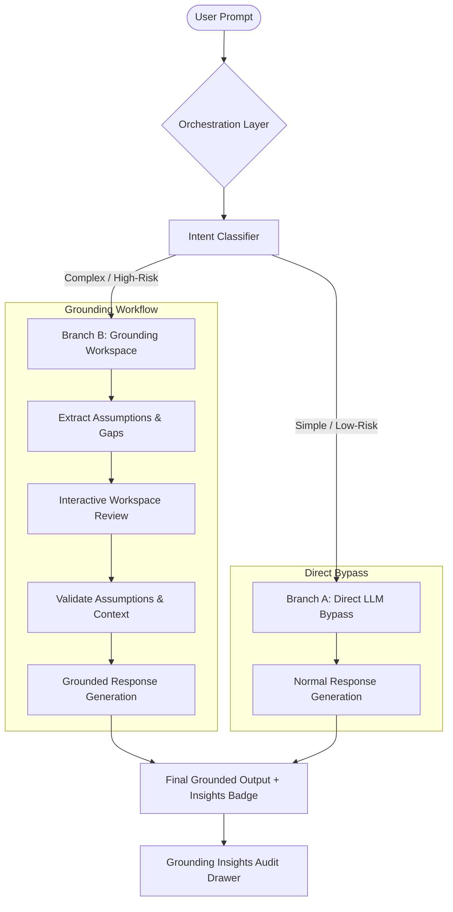

# 🛡️ ChatGPT Grounding Layer

An elegant AI validation and orchestration layer that triages user prompts, extracts assumptions, and bridges context gaps to mitigate AI overtrust.

---

## 🚀 Core Features

*   **Intelligent Triage**: Automatically branches between simple direct responses and complex grounding workflows based on query risk.
*   **Assumption Extraction**: High-fidelity isolation of implicit or structural assumptions that require user verification.
*   **Context Bridging**: Active synthesis of critical missing details and informational gaps with guided workspace fields.
*   **Grounded Generation**: Injects validated context and user-approved parameters into system prompts to produce ultra-accurate outputs.
*   **Insights Audit**: Premium right-aligned drawer panel displaying confidence scores, latency parameters, and token alignments.
*   **Three-Tier Failover**: Resilient failover chain (Gemini 1.5 Flash $\rightarrow$ Groq Llama 3.3 $\rightarrow$ local mock engine) ensuring continuous uptime.

---

## 🔄 System Workflow



---

## ⚡ Quick Start

### Prerequisites
*   **Node.js** 20+ & **Python** 3.10+
*   **Gemini API Key** and/or **Groq API Key** in `backend/.env`

### 1. Backend Servers (TypeScript & Python)
Choose either server to run your LLM grounding endpoints:

*   **TypeScript (Express)**:
    ```bash
    cd backend && npm install && npm run dev
    ```
*   **Python (FastAPI / Vercel)**:
    ```bash
    pip install -r requirements.txt && python api/index.py
    ```

### 2. Frontend Client (React)
```bash
cd frontend && npm install && npm run dev
```

---

## 📂 Project Directory Structure

```text
├── api/                      # Vercel-compatible Python backend API
│   ├── index.py              # FastAPI routing entry point
│   ├── classifier.py         # Prompt classifier (Gemini + Groq + Mock)
│   ├── planner.py            # Response generator orchestrator
│   └── mcp.py                # Model client connections
│
├── backend/                  # TypeScript Express API server
│   └── src/                  # Controllers, services, and routes
│
├── frontend/                 # React 19 + Vite 8 client
│   └── src/                  # Components (Sidebar, Workspace, Insights)
│
└── docs/                     # MVP architecture & specifications
```

---

## 📄 License

MIT
