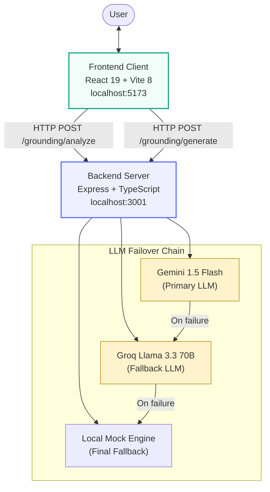
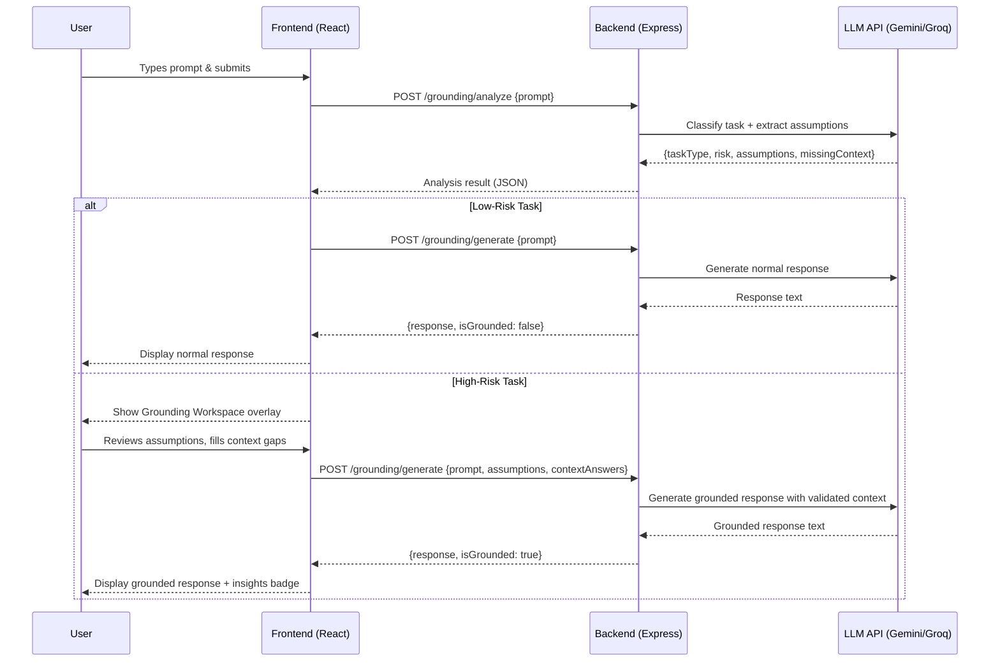
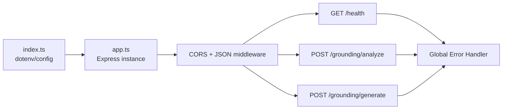
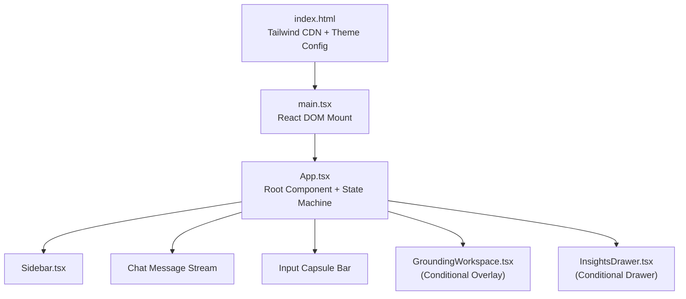
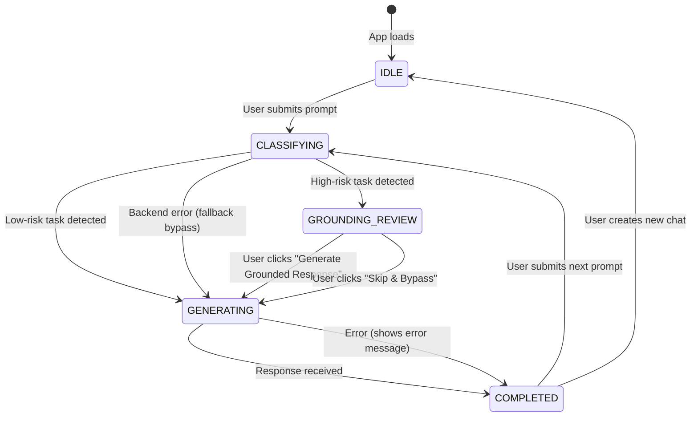
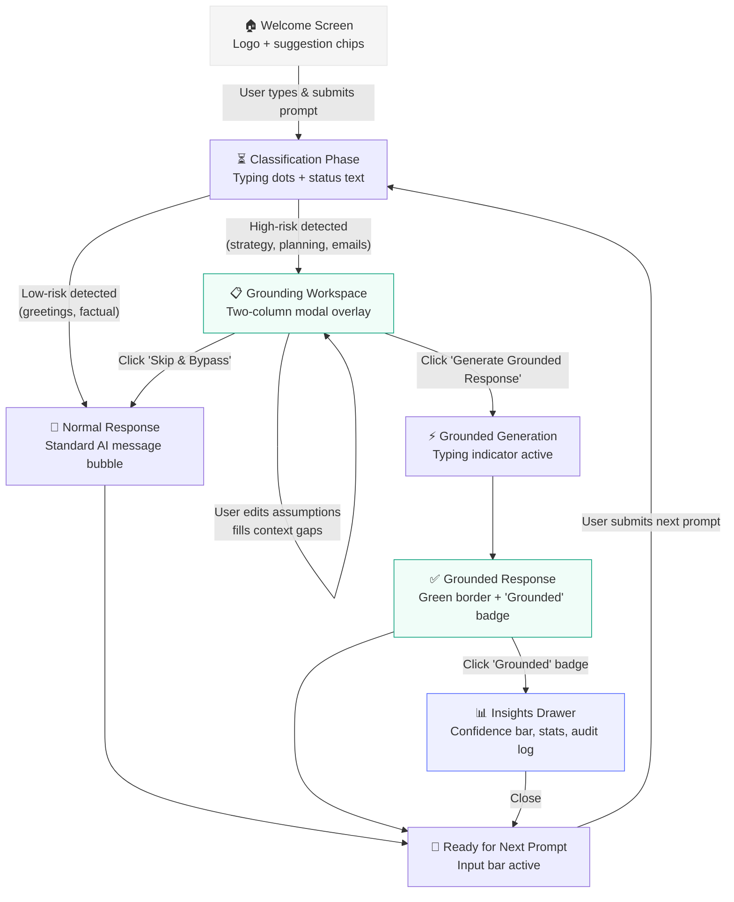
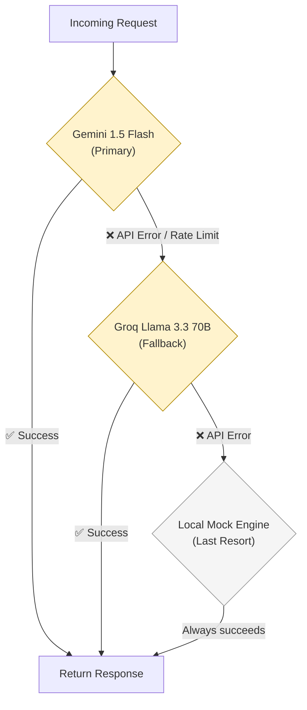
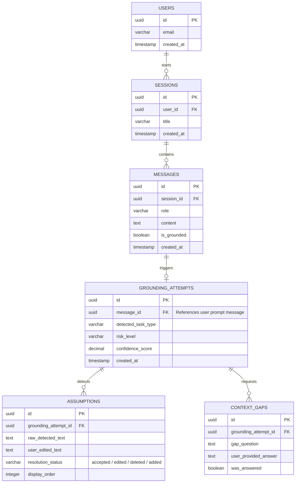
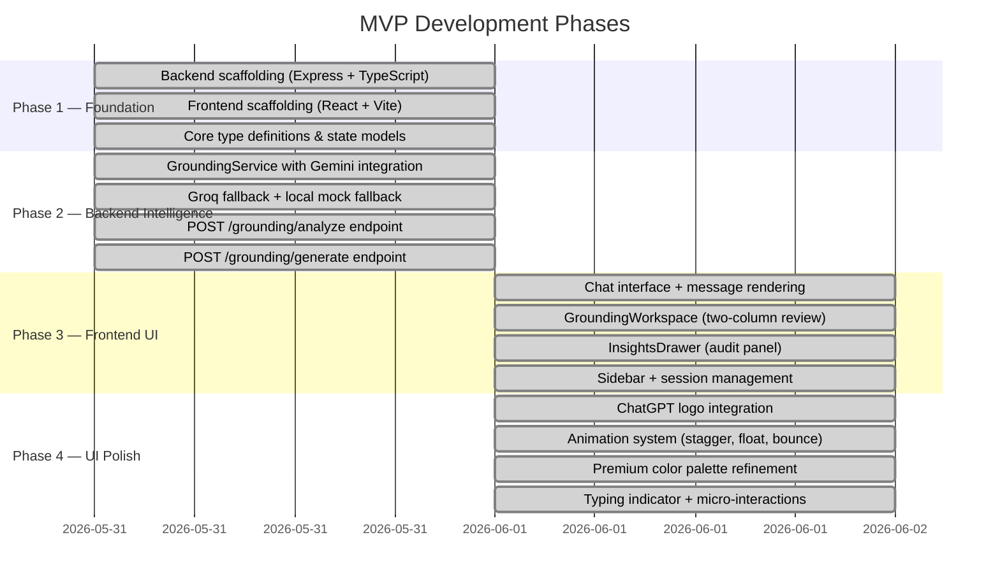

# MVP Architecture & Design Specification
## AI Grounding Layer — ChatGPT Prototype

> **Version**: 1.0 (MVP Implemented)  
> **Last Updated**: June 2026  
> **Stack**: React 19 + Vite 8 · Express 4 + TypeScript · Gemini 1.5 Flash · Groq Llama 3.3 70B

---

## Table of Contents

1. [Project Overview](#1-project-overview)
2. [System Architecture](#2-system-architecture)
3. [Technology Stack](#3-technology-stack)
4. [Project Directory Structure](#4-project-directory-structure)
5. [Backend Architecture](#5-backend-architecture)
6. [Frontend Architecture](#6-frontend-architecture)
7. [State Management](#7-state-management)
8. [API Specification](#8-api-specification)
9. [Component Hierarchy](#9-component-hierarchy)
10. [User Flow & Screen Transitions](#10-user-flow--screen-transitions)
11. [LLM Failover Strategy](#11-llm-failover-strategy)
12. [Database Schema (Future Production)](#12-database-schema-future-production)
13. [Phased Development Plan](#13-phased-development-plan)

---

## 1. Project Overview

### Problem Statement

AI assistants like ChatGPT generate highly polished, confident responses. Users frequently trust outputs because they appear professional and well-structured, leading to **overtrust** and **reduced verification**. The problem is not AI adoption — it is the difficulty of evaluating AI outputs before acting on them.

### Solution

Introduce a **Grounding Layer** between the user's prompt and the AI-generated response that:

1. **Detects assumptions** being made from the prompt
2. **Identifies missing context** that could affect response quality
3. **Presents assumptions** to the user for interactive review
4. **Allows users** to accept, edit, remove, or add assumptions
5. **Generates responses** using validated assumptions only
6. **Activates selectively** — only for high-risk tasks (strategy, planning, analysis, decision-making)
7. **Bypasses automatically** for low-risk tasks (greetings, summaries, translations, factual queries)

### Target Users

| Segment | Role |
|---------|------|
| Primary | Knowledge Workers, Product Managers, Business Analysts |
| Secondary | Researchers, Consultants, Strategy Professionals |

### MVP Scope

| Included | Excluded |
|----------|----------|
| ✅ Full frontend prototype | ❌ Authentication / User Accounts |
| ✅ Live LLM integration (Gemini + Groq) | ❌ Persistent database |
| ✅ Assumption detection & review workflow | ❌ Enterprise features |
| ✅ Context gap identification & bridging | ❌ Real-time collaboration |
| ✅ Grounded response generation | ❌ Streaming responses |
| ✅ Grounding insights audit panel | ❌ Payment / Billing |

---

## 2. System Architecture

### High-Level Architecture Diagram

The system follows a **client-server architecture** with a React frontend communicating with an Express.js backend. The backend handles task classification and response generation via LLM APIs with automatic failover.



### Data Flow Sequence



---

## 3. Technology Stack

### Frontend

| Layer | Technology | Version | Purpose |
|-------|-----------|---------|---------|
| Framework | React | 19.2.6 | Component-based UI |
| Build Tool | Vite | 8.0.12 | Dev server & bundler |
| Language | TypeScript | 6.0.2 | Type safety |
| Styling | Tailwind CSS (CDN) | Latest | Utility-first CSS |
| Fonts | Google Fonts | — | Inter, JetBrains Mono |
| Icons | Material Symbols Outlined | — | Google icon library |

### Backend

| Layer | Technology | Version | Purpose |
|-------|-----------|---------|---------|
| Runtime | Node.js | 20+ | Server runtime |
| Framework | Express | 4.19.2 | HTTP server & routing |
| Language | TypeScript | 5.4.5 | Type safety |
| Primary LLM | @google/generative-ai | 0.24.1 | Gemini 1.5 Flash |
| Fallback LLM | groq-sdk | 1.2.1 | Llama 3.3 70B Versatile |
| Environment | dotenv | 16.4.5 | Environment variable management |
| Dev Runner | ts-node-dev | 2.0.0 | Hot-reload development |

---

## 4. Project Directory Structure

```
ChatGPT prototype/
│
├── Problem statement.md              # Original problem definition
│
├── docs/
│   ├── mvp_architecture.md           # This document
│   ├── task.md                       # Development task tracking
│   └── walkthrough.md                # Implementation walkthrough
│
├── backend/
│   ├── .env                          # API keys (GEMINI_API_KEY, GROQ_API_KEY)
│   ├── .env.example                  # Environment template
│   ├── package.json                  # Dependencies & scripts
│   ├── tsconfig.json                 # TypeScript configuration
│   └── src/
│       ├── index.ts                  # Entry point — loads dotenv, starts server
│       ├── app.ts                    # Express app — CORS, JSON parsing, routes
│       ├── controllers/
│       │   ├── grounding.controller.ts   # Request handlers for analyze & generate
│       │   └── health.controller.ts      # Health check endpoint
│       ├── routes/
│       │   └── grounding.routes.ts       # POST /analyze, POST /generate
│       ├── middlewares/
│       │   └── error.middleware.ts        # Global error handler
│       └── services/
│           └── grounding.service.ts      # Core business logic — LLM calls & failover
│
└── frontend/
    ├── index.html                    # HTML shell — Tailwind CDN, fonts, theme config
    ├── package.json                  # Dependencies & scripts
    ├── vite.config.ts                # Vite configuration
    ├── tsconfig.json                 # TypeScript project references
    ├── public/
    │   ├── chatgpt-logo.png          # ChatGPT logo asset
    │   ├── favicon.svg               # Browser favicon
    │   └── icons.svg                 # Icon spritesheet
    └── src/
        ├── main.tsx                  # React mount point
        ├── App.tsx                   # Root component — state machine, pipeline logic
        ├── App.css                   # Minimal app styles
        ├── index.css                 # Animation system, scrollbar, global styles
        ├── types.ts                  # TypeScript interfaces (shared types)
        └── components/
            ├── Sidebar.tsx           # Navigation sidebar — sessions, settings
            ├── GroundingWorkspace.tsx # Two-column assumption review overlay
            └── InsightsDrawer.tsx    # Grounding audit insights drawer
```

---

## 5. Backend Architecture

### Entry Point Flow



### Service Layer — `GroundingService`

The `GroundingService` class is the core business logic layer. It encapsulates:

| Method | Purpose |
|--------|---------|
| `analyzePrompt(prompt)` | Classifies task risk, extracts assumptions & context gaps |
| `generateResponse(prompt, assumptions?, contextAnswers?)` | Generates final response (normal or grounded) |
| `analyzeWithGemini(prompt)` | Primary analysis via Gemini 1.5 Flash (JSON mode) |
| `analyzeWithGroq(prompt)` | Fallback analysis via Groq Llama 3.3 70B |
| `analyzeWithMockLocal(prompt)` | Last-resort local keyword-based classifier |
| `generateNormalResponse(prompt)` | Normal (ungrounded) LLM response |
| `generateGroundedResponse(prompt, assumptions, contextAnswers)` | Grounded response with validated context injected |

### System Prompt (Classification Engine)

The backend uses a carefully crafted system prompt that instructs the LLM to output structured JSON:

```json
{
  "taskType": "decision-making | planning | strategy | research | analysis | content-generation | greetings-and-summaries",
  "risk": "high | low",
  "assumptions": ["extracted assumption 1", "extracted assumption 2"],
  "missingContext": ["what is your budget?", "what region are you targeting?"]
}
```

**Classification Rules:**
- **High-Risk**: Complex, strategic, decision-heavy tasks; professional emails/reports that rely on implicit placeholders or organizational context
- **Low-Risk**: Basic greetings, simple factual questions, direct translations, summarization of provided text

---

## 6. Frontend Architecture

### Application Shell

The frontend uses a **single-page application** architecture with React 19 and Vite 8:



### Tailwind Theme Configuration

Custom color tokens are registered directly in the HTML shell via `tailwind.config`:

| Token | Hex | Usage |
|-------|-----|-------|
| `chatgpt-green` | `#10a37f` | Primary accent, badges, confidence bars |
| `primary` | `#000000` | Heading text, strong labels |
| `surface` | `#ffffff` | Card backgrounds |
| `background` | `#f9f9f9` | Page background |
| `on-surface-variant` | `#4c4546` | Secondary text |
| `outline` | `#e5e5e5` | Borders, dividers |
| `outline-variant` | `#cfc4c5` | Subtle borders |
| `error` | `#ba1a1a` | Error states, warnings |

---

## 7. State Management

### State Machine Model

The application operates as a **finite state machine** with 5 discrete states:



### Core State Interfaces

```typescript
// Chat session container
interface ChatSession {
  sessionId: string;
  title: string;
  messages: Message[];
  currentState: 'IDLE' | 'CLASSIFYING' | 'GROUNDING_REVIEW' | 'GENERATING' | 'COMPLETED';
}

// Individual message in the conversation
interface Message {
  messageId: string;
  role: 'user' | 'assistant';
  content: string;
  isGrounded: boolean;
  groundingInsights?: GroundingInsights;
}

// Active grounding review session data
interface GroundingReviewState {
  originalPrompt: string;
  taskCategory: string;
  assumptions: AssumptionItem[];
  missingContextGaps: ContextGapItem[];
}

// Individual assumption card state
interface AssumptionItem {
  id: string;
  text: string;
  status: 'pending' | 'accepted' | 'edited' | 'deleted';
  originalText?: string;
}

// Individual context gap input state
interface ContextGapItem {
  id: string;
  question: string;
  userInput: string;
  isRequired: boolean;
}

// Post-generation grounding audit data
interface GroundingInsights {
  originalAssumptionsCount: number;
  validatedAssumptions: string[];
  contextAnswersMerged: string[];
  metadata: {
    latencyMs: number;
    tokensSaved: number;
  };
}
```

### Key State Variables in App.tsx

| Variable | Type | Purpose |
|----------|------|---------|
| `sessions` | `ChatSession[]` | All chat sessions in memory |
| `activeSessionId` | `string` | Currently selected session |
| `simulationMode` | `boolean` | Toggle grounding classifier on/off |
| `artificialLatency` | `number` | Configurable UI latency (ms) |
| `appState` | State enum | Current FSM state |
| `reviewState` | `GroundingReviewState \| null` | Active grounding review data |
| `activeInsights` | `GroundingInsights \| null` | Active insights drawer data |

---

## 8. API Specification

### Base URL

```
http://localhost:3001
```

### Endpoints

#### `GET /health`
Health check endpoint.

**Response**: `200 OK`
```json
{ "status": "ok", "timestamp": "2026-06-01T00:00:00.000Z" }
```

---

#### `POST /grounding/analyze`
Classifies a user prompt, extracts assumptions, and identifies missing context gaps.

**Request Body**:
```json
{
  "prompt": "Develop a market entry strategy for launching a boutique organic skincare brand in Tokyo."
}
```

**Response** (`200 OK`):
```json
{
  "taskType": "strategy",
  "risk": "high",
  "assumptions": [
    "There is existing demand for organic skincare in Tokyo",
    "The brand has sufficient capital for international market entry",
    "Regulatory requirements for skincare products in Japan are manageable"
  ],
  "missingContext": [
    "What is the initial launch budget?",
    "What is the target customer age demographic?",
    "Are there existing distribution partnerships in Japan?"
  ]
}
```

**Error Response** (`400`):
```json
{ "error": "Field \"prompt\" is required" }
```

---

#### `POST /grounding/generate`
Generates an AI response. If `assumptions` and `contextAnswers` are provided, generates a **grounded** response using validated context. Otherwise, generates a **normal** response.

**Request Body (Normal)**:
```json
{
  "prompt": "Hello, how are you?"
}
```

**Request Body (Grounded)**:
```json
{
  "prompt": "Develop a market entry strategy for launching a boutique organic skincare brand in Tokyo.",
  "assumptions": [
    "There is existing demand for organic skincare in Tokyo",
    "The brand has $500K initial budget"
  ],
  "contextAnswers": [
    {
      "question": "What is the initial launch budget?",
      "answer": "$500,000 USD"
    },
    {
      "question": "What is the target customer age demographic?",
      "answer": "Women aged 25-40"
    }
  ]
}
```

**Response** (`200 OK`):
```json
{
  "response": "## Market Entry Strategy for Tokyo...\n\n...",
  "isGrounded": true
}
```

---

## 9. Component Hierarchy

### Visual Component Tree

```
App (Root — State Machine Controller)
│
├── Sidebar
│   ├── Brand Header (ChatGPT logo + title)
│   ├── New Chat Button
│   ├── Session History List
│   │   └── Session Item (active/inactive states)
│   └── Engine Settings Tray
│       ├── Grounding Classifier Toggle
│       └── Latency Boost Slider
│
├── Main Content Area
│   ├── Top Navigation Bar
│   │   ├── Model Title ("ChatGPT")
│   │   ├── Engine Status Badge (Failover Engine v4)
│   │   ├── State Indicator (Online / Classifying / Generating / Review active)
│   │   └── User Actions (Share, Profile)
│   │
│   ├── Chat Message Stream
│   │   ├── Welcome State (logo, heading, suggestion chips)
│   │   └── Message List
│   │       ├── User Message Bubble (right-aligned, gray bg)
│   │       └── AI Message Bubble (left-aligned, white bg)
│   │           ├── Markdown Renderer (headings, bold, bullets)
│   │           └── Grounded Badge → opens InsightsDrawer
│   │
│   ├── Typing Indicator (three animated dots)
│   │
│   └── Input Capsule Bar
│       ├── New Chat Button (+)
│       ├── Text Input (with placeholder based on mode)
│       ├── Microphone Button
│       └── Send Button (arrow_upward, filled)
│
├── GroundingWorkspace (Conditional modal overlay)
│   ├── Header (shield icon + category badge)
│   ├── Split Columns
│   │   ├── Left: Detected Assumptions
│   │   │   ├── Assumption Cards (icon, textarea, delete/restore)
│   │   │   └── Add Custom Assumption Input
│   │   └── Right: Missing Context Gaps
│   │       ├── Context Gap Fields (label + input)
│   │       └── Pro Tip Box
│   └── Footer (Skip & Bypass | Generate Grounded Response)
│
└── InsightsDrawer (Conditional right panel)
    ├── Header (logo + title + close)
    ├── Confidence Bar (gradient, animated)
    ├── Stats Grid (2x2 bento cards)
    │   ├── Assumptions Reviewed
    │   ├── Assumptions Discarded
    │   └── Context Gaps Answered
    ├── Alignment Audit Observations
    │   ├── Anchored Assumption Cards (green check)
    │   ├── Injected Context Cards (purple star)
    │   └── Direct Bypass Warning (if applicable)
    └── Footer (Export PDF | Apply Findings)
```

---

## 10. User Flow & Screen Transitions

### Complete User Journey



### Example Scenarios

| User Input | Risk Classification | Flow |
|-----------|---------------------|------|
| "Hello!" | `low` | Direct normal response |
| "What is the capital of France?" | `low` | Direct normal response |
| "Draft a quarterly budget plan for our engineering team" | `high` | Grounding workspace → review → grounded response |
| "Generate an email to my manager about the annual report" | `high` | Grounding workspace (detects [Manager Name], [Year] placeholders) |
| "Develop a market entry strategy for Tokyo" | `high` | Grounding workspace → assumptions + context gaps |

---

## 11. LLM Failover Strategy

The backend implements a **three-tier failover chain** for both analysis and generation:



| Tier | Provider | Model | Response Format | When Used |
|------|----------|-------|-----------------|-----------|
| 1 (Primary) | Google Gemini | gemini-1.5-flash | `responseMimeType: 'application/json'` | API key configured & valid |
| 2 (Fallback) | Groq | llama-3.3-70b-versatile | `response_format: { type: 'json_object' }` | Gemini fails or unconfigured |
| 3 (Mock) | Local | Keyword matcher | Hardcoded JSON responses | Both APIs fail or unconfigured |

### Environment Configuration

```env
# backend/.env
GEMINI_API_KEY=your_gemini_api_key_here
GROQ_API_KEY=your_groq_api_key_here
PORT=3001
NODE_ENV=development
```

---

## 12. Database Schema (Future Production)

While the MVP runs purely in-memory (client-side state), a production implementation requires a relational schema for grounding compliance tracking, user validation metrics, and audit trails.



---

## 13. Phased Development Plan

Development was executed across four sequential phases:



### Phase Descriptions

#### Phase 1: Foundation
Established the monorepo structure with separate `backend/` and `frontend/` directories. Set up Express with TypeScript for the backend and React 19 + Vite 8 for the frontend. Defined all shared TypeScript interfaces.

#### Phase 2: Backend Intelligence
Implemented the `GroundingService` class with the three-tier LLM failover strategy (Gemini → Groq → Mock). Created the classification system prompt that returns structured JSON. Built two API endpoints: `/grounding/analyze` for task classification and `/grounding/generate` for response generation (both normal and grounded).

#### Phase 3: Frontend UI
Built the complete ChatGPT-style interface with Tailwind CSS. Implemented the state machine controller in `App.tsx`, the sidebar with session management, the two-column `GroundingWorkspace` overlay for assumption review, and the `InsightsDrawer` audit panel with confidence metrics.

#### Phase 4: UI Polish
Integrated the official ChatGPT logo throughout the interface. Added a comprehensive CSS animation system with staggered entrances, typing indicators, hover-lift effects, press feedback, and shimmer loading bars. Refined the color palette to an Apple-inspired system for premium visual quality.

---

## Running the Application

### Prerequisites
- Node.js 20+
- Gemini API key (primary) and/or Groq API key (fallback)

### Backend
```bash
cd backend
cp .env.example .env        # Add your API keys
npm install
npm run dev                  # Starts on http://localhost:3001
```

### Frontend
```bash
cd frontend
npm install
npm run dev                  # Starts on http://localhost:5173
```

### Production Build
```bash
cd frontend
npm run build                # Outputs to frontend/dist/
```
